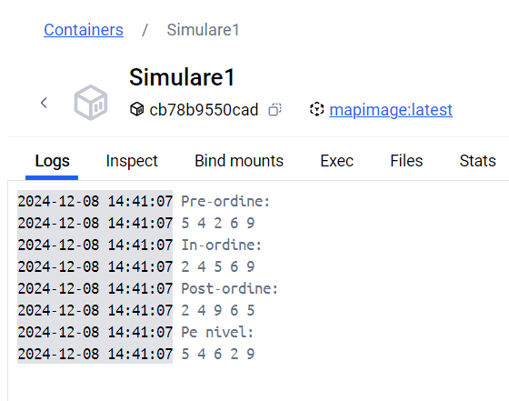

# Traversarea Arborilor Binari Ordonați

---

## Descriere
Acest proiect abordează problema **traversării arborilor binari ordonați**. Arborele este populat cu elemente aleatorii, iar utilizatorul poate efectua următoarele tipuri de traversări:
- **Pre-ordine** (Root → Left → Right)
- **In-ordine** (Left → Root → Right)
- **Post-ordine** (Left → Right → Root)
- **Pe niveluri** (Level-order)

---

## Tehnologii utilizate
- **Python**: Limbaj de programare utilizat pentru implementare.
- **Docker**: Pentru rularea proiectului într-un mediu izolat și portabil.
- **Git/GitHub**: Gestionarea și versionarea codului.

---

## Biblioteci utilizate
### `random`
- Folosită pentru generarea valorilor aleatoare pentru nodurile arborelui.
- **Funcționalitate cheie**: `random.randint(min_value, max_value)` creează valori diverse pentru arborele generat.

### `collections.deque`
- Utilizată în traversarea **pe niveluri** (Level-order traversal).
- Deque asigură gestionarea eficientă a nodurilor în stil **FIFO** (*First In, First Out*).

---

## Cum se rulează proiectul

### 1. **Rularea direct cu Python**
Dacă dorești să rulezi proiectul local, fără containere Docker:
python MAP.py

### 2. **Rularea pe Docker**
Pentru a rula proiectul într-un container Docker, urmează pașii:
1. Construiește imaginea Docker
docker build -t mapimagine .
2. Rulează containerul:
docker run --rm mapimagine

# Mai jos este afișată o captură de ecran cu ieșirea din container după rularea proiectului folosind Docker:

## Rezultate

 **Git și GitHub**:
  - Gestionarea codului sursă cu **Git** și **GitHub**.
  - Commit-uri clare și mesaje descriptive pentru urmărirea evoluției proiectului.
  
   **Docker**:
  - Containerizarea proiectului folosind **Docker** pentru rulare izolat și portabilă.
  - Utilizarea unui **Dockerfile** pentru configurarea mediului necesar.
  - Rularea ușoară a proiectului cu comenzi `docker build` și `docker run --rm`.

- **Corectitudinea implementării**:
  - Traversarea arborilor binari funcționează corect pentru toate metodele (Pre-ordine, In-ordine, Post-ordine, Pe niveluri).
  
- **Portabilitate**:
  - Proiectul rulează uniform pe orice sistem datorită Docker.
